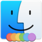
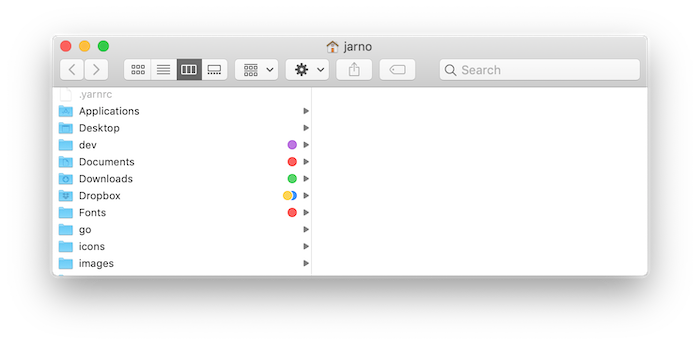
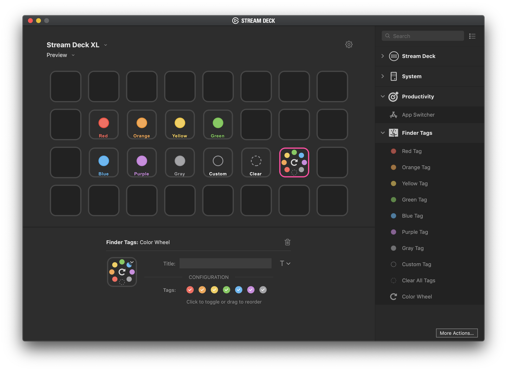

# Finder Tags plugin for Stream Deck

This Stream Deck plugin will let you add color labels to file(s) and folder(s) in the Finder.



# Description

With this plugin installed, you can easily add/remove tags by pressing the color buttons on your Stream Deck. You can also choose to use the color wheel, which is a single button, so there is more space left on the Stream Deck. The color wheel will let you tap through the colors Red, Orange, Yellow, Green, Blue, Purple, Gray. Furthermore you can create a button for assigning a custom tag, which you can give any label you want, and in addition to that you can give the custom tag a color too.

It's made for *macOS* only.

# Features

- 7 color buttons for quickly adding a color tag to the selected files.
- A color wheel, which rotates the color in the following order: ```Red, Orange, Yellow, Green, Blue, Purple, Gray```
- Assign custom tags, optionally with a color.
- A single button for clearing all tags from the selected files.



# How to install

1. Download the latest release from the [releases](https://github.com/JarnoLeConte/streamdeck-findertags/releases) page.
2. Double click the `me.hckr.findertags.streamDeckPlugin` to install.

# Info for developers

- It's built with the following template: [streamdeck-template-swift](https://github.com/JarnoLeConte/streamdeck-template-swift)
- Code written in Swift
- Uses the Property Inspector (PI) to configure custom tags
- PI written in React
- Runs AppleScript
- macOS only
